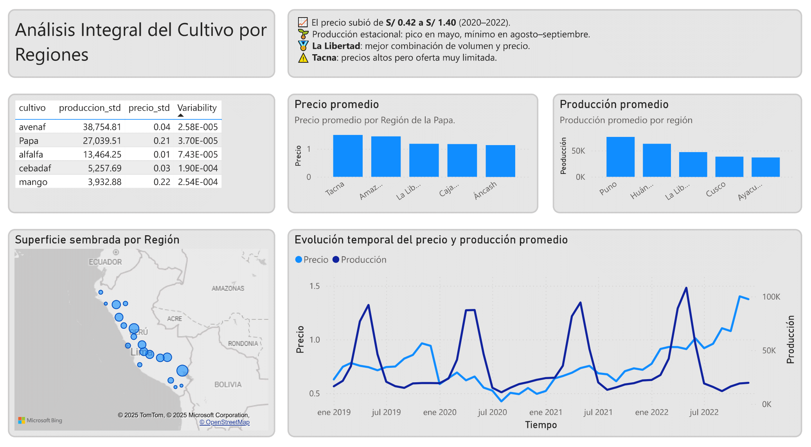

# 🌾 **Producción Agrícola Nacional**

This project is a series of steps to build a Power BI dashboard using data from the Peruvian Ministry of Agriculture (*Producción Agrícola*).

I analyzed the annual agricultural datasets across multiple years.
The main features included are:

* 🌱 **Superficie sembrada** (ha) por región.
* 🌾 **Superficie cosechada** (ha) por región.
* 🚜 **Producción total** (t) por región.
* 📈 **Rendimiento promedio** (kg/ha).
* 💲 **Precio promedio en chacra** (Soles/kg).

This data includes **multiple regions** and **different crop types**.
It allows us to explore agricultural performance, economic value, and production dynamics.

Alongside the dashboard, I developed **machine learning models** for price prediction, which can be tested on Hugging Face.

---

## 📊 **Dashboard**

### Page 1: **Producción Agrícola Nacional**

**Main question:**

> How did Peru’s total agricultural production and its main crops perform in 2022 compared to previous years, and which products contributed most to the sector’s economic growth or decline?

**Conclusion:**

En **2022**, la producción agrícola nacional alcanzó **65.68 millones de toneladas** con un valor económico de **S/ 52.44 mil millones**, mostrando un crecimiento de **+19.86%** respecto a 2021.

Los cultivos con mayor aporte económico fueron:

* 🥔 **Papa (15.75%)**
* 🌾 **Arroz (8.45%)**
* ☕ **Café (8.30%)**

Destacó la recuperación de:

* 🥔 Papa **(+49%)**
* ☕ Café **(+35%)**

Mientras que:

* 🥑 Palta presentó una ligera caída **(–2.67%)**

En general, el sector mantiene una **tendencia creciente** desde 2019, impulsada por mejoras en rendimiento y estabilidad productiva.

### 🤖 Machine Learning: Price Prediction

The **Random Forest** model shows strong performance in predicting the **price of agricultural products** using production and regional characteristics.

| Metric         | Value      |
| -------------- | ---------- |
| **RMSE**       | **0.438**  |
| **R² (Test)**  | **0.9039** |
| **R² (Train)** | **0.988**  |

🔗 **Test the model here:**
[https://huggingface.co/spaces/Galois2024/VPB-PricePrediction](https://huggingface.co/spaces/Galois2024/VPB-PricePrediction)

---

## 🛠 Page 2: Potato Market Insights 2019–2022

**Main question:**
> How did the stability, price behavior, and production of Peru’s potato crop evolve between 2019 and 2022, and which regions and months offered the strongest opportunities for profitability based on seasonal peaks and supply-driven price changes?

**Conclusion:**

Analicé cientos de cultivos usando una métrica de estabilidad basada en precio y producción.
La papa destacó como uno de los cultivos más estables del país.

- 📈 El precio subió de S/ 0.42 a S/ 1.40 (2020–2022).
- 🌱 Producción estacional: pico en mayo, mínimo en agosto–septiembre.
- 🏅 La Libertad: mejor combinación de volumen y precio.
- ⚠️ Tacna: precios altos pero oferta muy limitada.

Conclusión: La papa ofrece estabilidad, crecimiento y oportunidades claras para inversión agrícola estratégica.

### 🤖 Machine Learning: 